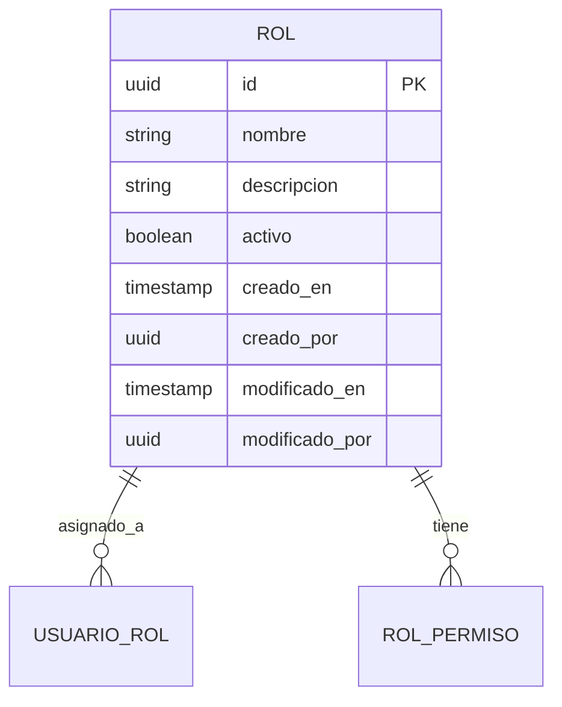

# Modelo de Roles

## Visión General

El modelo `rol` es un componente fundamental del sistema de control de acceso basado en roles (RBAC) de la aplicación. Define los diferentes perfiles de usuario y los permisos asociados a cada uno. Los roles son entidades de solo lectura que se utilizan para agrupar y gestionar permisos de manera eficiente.



## Documentación Técnica

- [Reglas de Negocio](./reglas_negocio.md)
- [Seguridad y Control de Acceso](./seguridad.md)
- [Estructura de la Base de Datos](#estructura-de-la-base-de-datos)
- [API de Integración](#api-de-integración)

## Estructura de la Base de Datos

### Tabla: rol

| Columna | Tipo | Requerido | Valor por Defecto | Validaciones | Descripción |
|---------|------|-----------|-------------------|--------------|-------------|
| id | string | ✅ | `uuid_generate_v4()` | UUID v4 | Identificador único del rol |
| nombre | string | ✅ | - | Único, 3-50 caracteres | Nombre del rol (ej: 'admin', 'usuario') |
| descripcion | string | ❌ | `NULL` | Hasta 255 caracteres | Descripción detallada del rol |
| creado_por | string | ❌ | ID del usuario autenticado | Referencia a usuario | Usuario que creó el registro |
| creado_en | Date | ❌ | `now()` | - | Fecha de creación del registro |
| modificado_por | string | ❌ | - | Referencia a usuario | Último usuario que modificó |
| modificado_en | Date | ❌ | `NULL` | - | Fecha de última modificación |
| anulado_por | string | ❌ | - | Referencia a usuario | Usuario que realizó la baja lógica |
| anulado_en | Date | ❌ | `NULL` | - | Fecha de baja lógica (soft delete) |

### Relaciones

- **usuario_rol**: Relación uno a muchos con `usuario_rol`
  - Un rol puede estar asignado a múltiples usuarios
  - Relación a través del campo `rol_id` en la tabla `usuario_rol`

### Índices

- **PRIMARY KEY** (`id`)
- **UNIQUE** `rol_nombre_key` (`nombre`)
- **INDEX** `IDX_rol_creado_por` (`creado_por`)
- **INDEX** `IDX_rol_modificado_por` (`modificado_por`)
- **INDEX** `IDX_rol_anulado_por` (`anulado_por`)

## API de Integración

### Endpoints Disponibles

#### 1. Listar Roles
```http
GET /api/roles
Authorization: Bearer {token}
```

**Parámetros de Consulta:**
- `page` - Número de página (por defecto: 1)
- `limit` - Cantidad de resultados por página (por defecto: 10, máximo: 100)
- `nombre` - Filtrar por nombre (búsqueda parcial que ignora mayúsculas/minúsculas)
- `sort` - Campo para ordenar resultados (ej: `nombre:asc`, `creado_en:desc`)

**Ejemplo de Uso:**
```typescript
// Obtener primera página de roles que contengan 'admin'
const response = await fetch('/api/roles?nombre=admin&page=1&limit=10', {
  headers: { 'Authorization': 'Bearer ' + token }
});
```

#### 2. Obtener Rol por ID
```http
GET /api/roles/{id}
Authorization: Bearer {token}
```

**Parámetros de Ruta:**
- `id` - ID único del rol (formato UUID v4)

**Ejemplo de Uso:**
```typescript
// Obtener detalles de un rol específico
const rolId = '550e8400-e29b-41d4-a716-446655440000';
const response = await fetch(`/api/roles/${rolId}`, {
  headers: { 'Authorization': 'Bearer ' + token }
});
```

### Respuestas de la API

#### 200 OK - Lista de Roles
```json
{
  "data": [
    {
      "id": "550e8400-e29b-41d4-a716-446655440000",
      "nombre": "administrador",
      "descripcion": "Acceso completo al sistema",
      "activo": true,
      "creado_en": "2025-01-01T00:00:00Z",
      "creado_por": "110e8400-e29b-41d4-a716-446655440000"
    }
  ],
  "paginacion": {
    "total": 5,
    "pagina": 1,
    "por_pagina": 10,
    "total_paginas": 1
  }
}
```

#### 200 OK - Detalle de Rol
```json
{
  "id": "550e8400-e29b-41d4-a716-446655440000",
  "nombre": "administrador",
  "descripcion": "Acceso completo al sistema",
  "activo": true,
  "creado_en": "2025-01-01T00:00:00Z",
  "creado_por": "110e8400-e29b-41d4-a716-446655440000",
  "modificado_en": null,
  "modificado_por": null,
  "permisos": [
    {
      "id": "660e8400-e29b-41d4-a716-446655440000",
      "nombre": "usuario.crear",
      "descripcion": "Permite crear usuarios"
    }
  ]
}
```

#### 404 No Encontrado
```json
{
  "codigo": "ROL_NO_ENCONTRADO",
  "mensaje": "El rol solicitado no existe o no está disponible",
  "detalles": {
    "id": "550e8400-e29b-41d4-a716-446655440000"
  }
}
```

## Consideraciones de Implementación

## Consideraciones de Implementación

### 1. Caché
Se recomienda implementar caché para las consultas de roles, ya que:
- Los roles rara vez cambian
- Se consultan frecuentemente para validar permisos
- Mejora el rendimiento del sistema

**Estrategia recomendada:**
- Usar Redis como capa de caché distribuida
- Invalidar caché cuando se actualicen los roles (aunque sean operaciones raras)
- TTL de 1 hora para la caché de roles

### 2. Seguridad
- Todas las operaciones requieren autenticación mediante JWT
- Validar siempre el token JWT en cada solicitud
- Implementar rate limiting (ej: 100 solicitudes/minuto por IP)
- Registrar todos los intentos de acceso fallidos
- Validar y sanitizar todos los parámetros de entrada

### 3. Auditoría
- Registrar todos los accesos a los endpoints de roles en `log_auditoria`
- Incluir metadatos relevantes en los logs:
  - ID del usuario autenticado
  - Dirección IP
  - User-Agent
  - Parámetros de la solicitud
  - Código de estado de la respuesta
  - Tiempo de procesamiento

### 4. Rendimiento
- Implementar paginación para listados grandes
- Usar `SELECT` explícito para recuperar solo los campos necesarios
- Considerar el uso de índices compuestos para consultas frecuentes
- Monitorear el rendimiento de las consultas regularmente

### 5. Mantenimiento
- Revisar periódicamente los logs de auditoría
- Monitorear intentos de acceso no autorizados
- Realizar copias de seguridad regulares de la base de datos
- Mantener actualizadas las dependencias de seguridad

## Documentación Relacionada

- [Documentación de Usuarios](../usuario/README.md)
- [Documentación de Permisos](../permiso/README.md)
- [Reglas de Negocio](./reglas_negocio.md)
- [Seguridad y Control de Acceso](./seguridad.md)

## Historial de Cambios

| Fecha | Versión | Cambio | Autor |
|-------|---------|--------|-------|
| 2025-06-07 | 1.0.0 | Documentación inicial | Equipo de Desarrollo |
