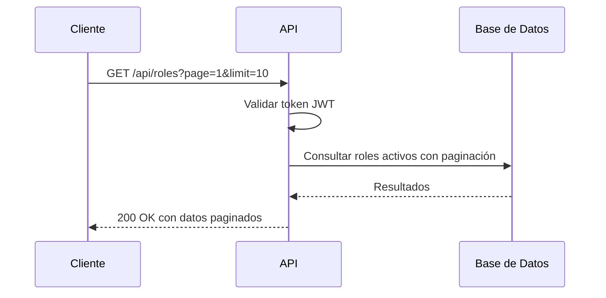
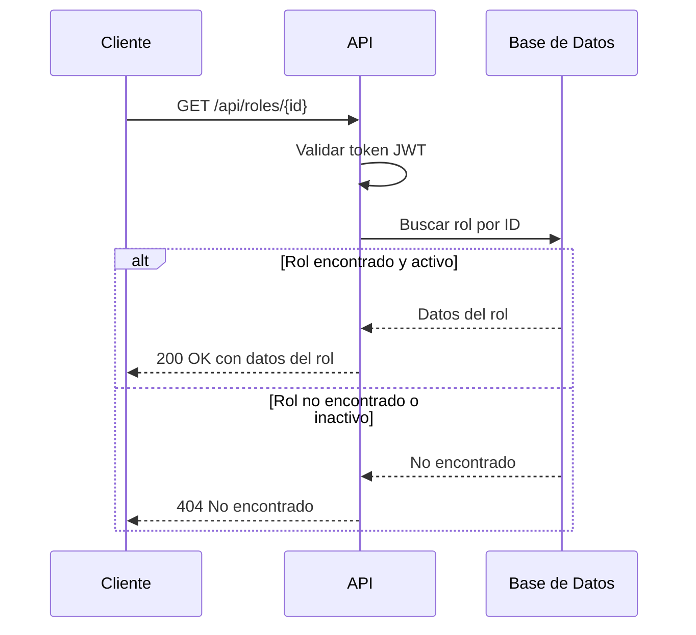

# Reglas de Negocio - Gestión de Roles

## 1. Visión General

Este documento define las reglas de negocio para la gestión de roles en el sistema. Los roles son entidades de solo lectura que definen los niveles de acceso y permisos disponibles para los usuarios.

## 2. Validaciones de Datos

### 2.1 Estructura del Rol

| Campo | Tipo | Requerido | Validaciones |
|-------|------|-----------|--------------|
| id | UUID | Sí | - Formato UUID v4 válido |
| nombre | string | Sí | - Entre 3 y 50 caracteres<br>- Solo letras, espacios y guiones bajos |
| descripcion | string | No | - Máximo 255 caracteres |
| activo | boolean | Sí | - true/false |
| creado_en | timestamp | Sí | - Formato ISO 8601 |
| creado_por | UUID | Sí | - Referencia a usuario existente |
| modificado_en | timestamp | No | - Formato ISO 8601 |
| modificado_por | UUID | No | - Referencia a usuario existente |

### 2.2 Reglas de Validación

1. **RB-001**: El campo `nombre` debe ser único en el sistema
   - **Código de Error**: `ROL_NOMBRE_DUPLICADO`
   - **Mensaje**: "El nombre del rol ya existe"

2. **RB-002**: Solo usuarios autenticados pueden consultar roles
   - **Código de Error**: `NO_AUTENTICADO`
   - **Mensaje**: "Se requiere autenticación para acceder a este recurso"

## 3. Reglas de Negocio

### 3.1 Listado de Roles (RB-101)
- **Descripción**: Obtener lista paginada de roles
- **Reglas**:
  - Todos los usuarios autenticados pueden listar roles
  - Se deben aplicar filtros por nombre y estado (activo/inactivo)
  - La respuesta debe incluir metadatos de paginación

### 3.2 Consulta de Rol por ID (RB-102)
- **Descripción**: Obtener detalles de un rol específico
- **Reglas**:
  - El rol debe existir y estar activo
  - El usuario debe estar autenticado
  - Incluir información de auditoría (creado_por, creado_en, etc.)

## 4. Flujos de Trabajo

### 4.1 Consulta de Lista de Roles



### 4.2 Consulta de Detalle de Rol



## 5. Integración con Otros Módulos

### 5.1 Usuarios
- Los roles están asociados a usuarios a través de la relación `usuario_rol`
- La consulta de un usuario incluye la lista de roles asignados

### 5.2 Permisos
- Cada rol tiene asociado un conjunto de permisos
- Los permisos definen las acciones que pueden realizar los usuarios con ese rol

## 6. Consideraciones Técnicas

### 6.1 Rendimiento
- Implementar caché de roles para reducir consultas a la base de datos
- Usar índices en campos de búsqueda frecuente (nombre, activo)

### 6.2 Seguridad
- Validar y sanitizar todos los parámetros de entrada
- Implementar rate limiting para prevenir ataques de fuerza bruta
- Registrar todas las operaciones en el sistema de auditoría

## 7. Ejemplos

### 7.1 Ejemplo de Creación

```typescript
// Crear un nuevo rol (operación de solo lectura, solo para referencia)
const nuevoRol = await prisma.rol.create({
  data: {
    nombre: "ejemplo_rol",
    descripcion: "Descripción del rol de ejemplo",
    creado_por: "ID_DEL_USUARIO_AUTENTICADO"
  }
});
```

### 7.2 Ejemplo de Consulta

```typescript
// Consultar roles con paginación
const roles = await prisma.rol.findMany({
  where: {
    anulado_en: null, // Solo roles no eliminados
    nombre: { contains: 'admin' } // Filtro opcional
  },
  skip: 0, // Offset para paginación
  take: 10, // Límite de resultados
  orderBy: {
    nombre: 'asc' // Ordenar por nombre
  },
  include: {
    usuario_rol: true // Incluir relaciones si es necesario
  }
});
```

### 7.3 Respuesta Exitosa - Lista de Roles

```json
{
  "data": [
    {
      "id": "550e8400-e29b-41d4-a716-446655440000",
      "nombre": "administrador",
      "descripcion": "Acceso completo al sistema",
      "creado_en": "2025-01-01T00:00:00Z",
      "creado_por": "110e8400-e29b-41d4-a716-446655440000",
      "modificado_en": null,
      "modificado_por": null,
      "anulado_en": null,
      "anulado_por": null
    }
  ],
  "paginacion": {
    "total": 5,
    "pagina": 1,
    "por_pagina": 10,
    "total_paginas": 1
  }
}
```

### 7.4 Respuesta de Error - Rol No Encontrado

```json
{
  "codigo": "ROL_NO_ENCONTRADO",
  "mensaje": "El rol solicitado no existe o no está disponible",
  "detalles": {
    "id": "550e8400-e29b-41d4-a716-446655440000"
  }
}
```

## 8. Historial de Cambios

| Fecha | Versión | Cambio | Autor |
|-------|---------|--------|-------|
| 2025-06-07 | 1.0.0 | Documentación inicial | Equipo de Desarrollo |
