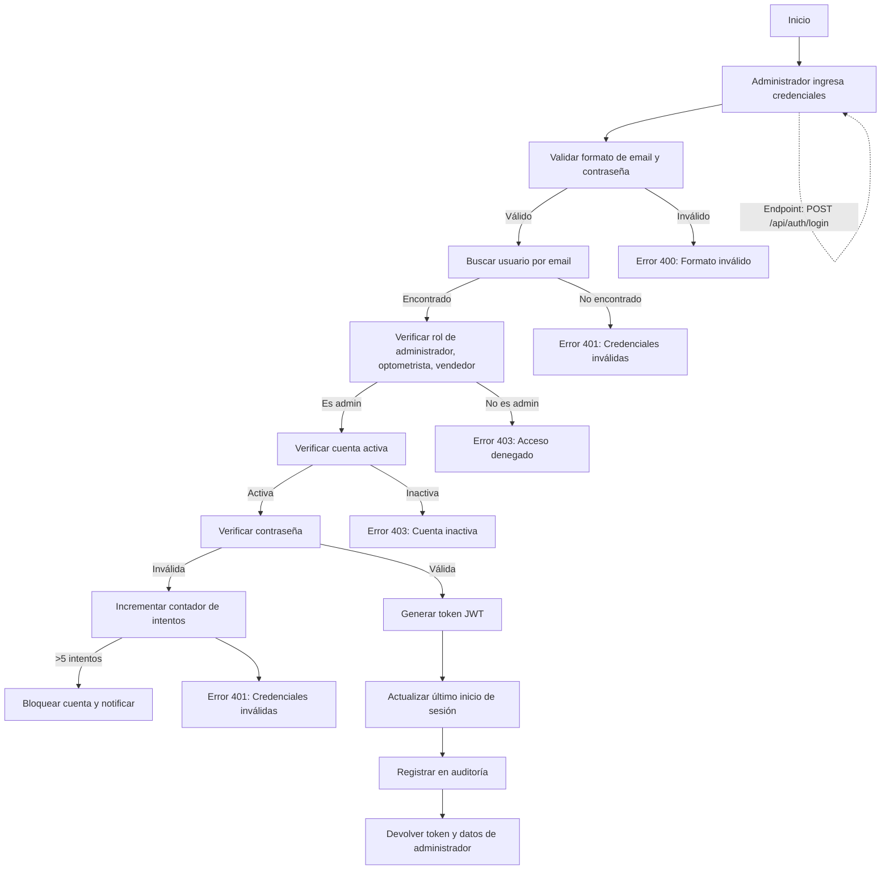

# Flujo de Autenticación Administrativa

## 1. Inicio de Sesión de Administrador, Optometrista, Vendedor

### 1.1. Diagrama de Flujo



### 1.2. Proceso Detallado

1. **Validación de Entrada**
   - Verificar que el email tenga formato válido
   - Verificar que la contraseña cumpla con los requisitos mínimos
   - Validar longitud de campos

2. **Búsqueda de Usuario**
   - Buscar usuario por email (case insensitive)
   - Si no existe, devolver error genérico

3. **Verificación de Rol**
   - Verificar que el usuario tenga rol de administrador
   - Si no es administrador, denegar acceso

4. **Verificación de Estado**
   - Verificar que la cuenta esté activa
   - Si está inactiva, indicar motivo (bloqueada, eliminada, etc.)

5. **Validación de Credenciales**
   - Comparar contraseña hasheada con bcrypt
   - Si falla, incrementar contador de intentos fallidos
   - Si supera el límite de intentos, bloquear la cuenta y notificar

6. **Generación de Token**
   - Generar JWT con expiración corta (15-30 min)
   - Incluir roles y permisos en el payload

7. **Actualización y Respuesta**
   - Actualizar fecha de último inicio de sesión
   - Registrar evento de inicio de sesión exitoso en auditoría
   - Devolver token y datos básicos del administrador

## 2. Seguridad del Token

### 2.1. Estructura del Token JWT

```json
{
  "sub": "usuario-uuid",
  "email": "admin@neoptica.com",
  "roles": ["admin", "optometrista", "vendedor"],
  "iat": 1623000000,
  "exp": 1623001800
}
```

### 2.2. Consideraciones de Seguridad

- Usar HTTPS para todas las comunicaciones
- Almacenar el token en HttpOnly cookies
- Implementar protección CSRF
- Rotar las claves de firma periódicamente
- Monitorear intentos de acceso sospechosos

## 3. Cierre de Sesión

### 3.1. Proceso de Cierre de Sesión

1. Eliminar la cookie de autenticación del lado del cliente
2. Opcionalmente, invalidar el token del lado del servidor
3. Registrar el evento de cierre de sesión en auditoría

### 3.2. Consideraciones de Seguridad

- Los tokens expiran automáticamente después de su tiempo de vida
- Para mayor seguridad, mantener una lista blanca de tokens activos
- Implementar cierre de sesión remoto para dispositivos perdidos o robados
