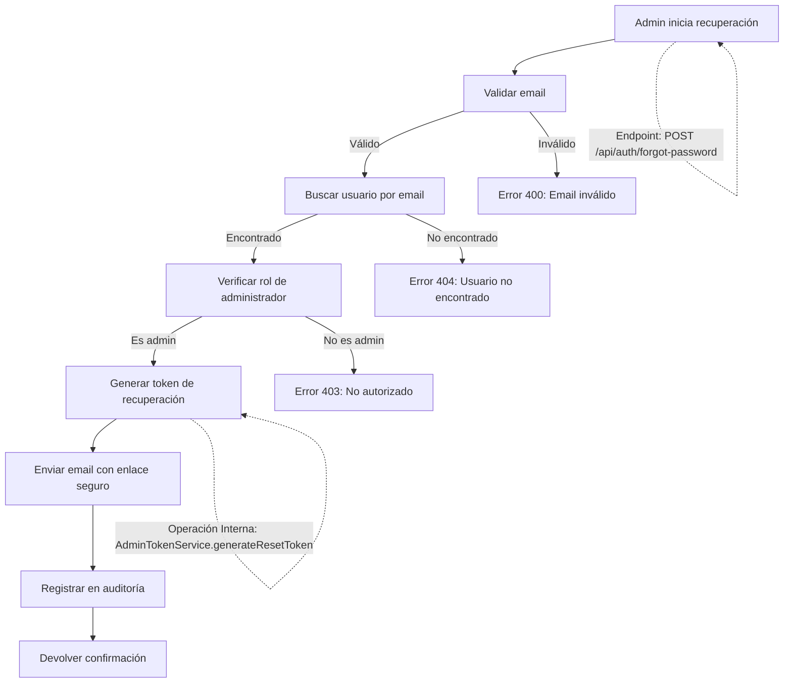
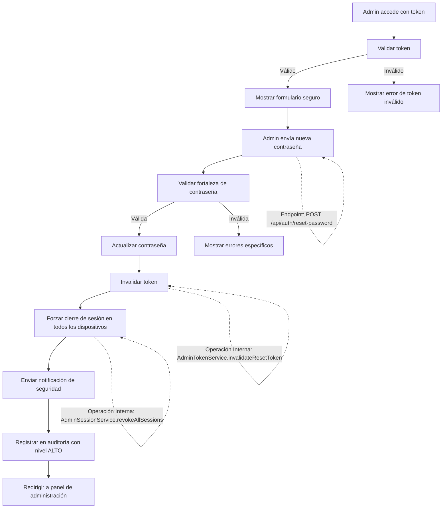

# Flujo de Recuperación de Contraseña para Administradores

## 1. Solicitud de Recuperación por Administrador

### 1.1. Diagrama de Flujo



### 1.2. Proceso Detallado

1. **Validación de Entrada**
   - Verificar que el email tenga formato válido
   - Validar que el usuario sea administrador

2. **Búsqueda de Usuario**
   - Buscar usuario por email (case insensitive)
   - Verificar que el usuario exista y esté activo

3. **Verificación de Rol**
   - Confirmar que el usuario tiene rol de administrador
   - Si no es administrador, denegar la operación

4. **Generación de Token**
   - Crear token único con expiración (1 hora para mayor seguridad)
   - Hashear el token antes de almacenarlo
   - Almacenar token asociado al usuario con metadatos de seguridad

5. **Envío de Email**
   - Incluir enlace con token en parámetro de URL
   - Usar plantilla de email segura para administradores
   - Incluir detalles de seguridad y advertencias

6. **Respuesta**
   - Registrar la solicitud en auditoría con nivel de seguridad ALTO
   - Devolver confirmación genérica de éxito

## 2. Restablecimiento de Contraseña

### 2.1. Diagrama de Flujo



### 2.2. Validaciones de Contraseña

Las contraseñas de administrador deben cumplir con requisitos de seguridad mejorados:

- Longitud mínima: 12 caracteres
- Requerir mayúsculas, minúsculas, números y caracteres especiales
- No permitir contraseñas comunes o comprometidas
- Verificar contra el historial de contraseñas del usuario
- No permitir patrones secuenciales o repetitivos

### 2.3. Seguridad Adicional

- Autenticación de dos factores requerida para restablecer contraseñas de administrador
- Registro detallado de intentos de acceso
- Notificación a otros administradores sobre el cambio de contraseña
- Bloqueo temporal después de múltiples intentos fallidos

## 3. Notificaciones de Seguridad

### 3.1. Email de Recuperación para Administradores
**Asunto**: [URGENTE] Solicitud de restablecimiento de contraseña de administrador

```
ALTA PRIORIDAD: SOLICITUD DE RESTABLECIMIENTO DE CONTRASEÑA

Hola [Nombre del Administrador],

Se ha solicitado el restablecimiento de la contraseña para tu cuenta de administrador.

Detalles de la solicitud:
- Fecha/Hora: [Fecha y hora actual]
- Dirección IP: [IP de origen]
- Ubicación aproximada: [Ciudad, País]
- Navegador/Dispositivo: [Información del User-Agent]

Si reconoces esta actividad, por favor haz clic en el siguiente enlace para continuar:
[Enlace de restablecimiento seguro]

ADVERTENCIA: Este enlace expirará en 1 hora por motivos de seguridad.

Si NO has solicitado este restablecimiento, comunícate inmediatamente con el equipo de seguridad.

Para tu protección, esta actividad ha sido registrada en nuestro sistema de auditoría.

Atentamente,
Equipo de Seguridad - Panel de Administración
```

### 3.2. Email de Confirmación de Cambio
**Asunto**: [CONFIRMACIÓN] Contraseña de administrador actualizada

```
CONFIRMACIÓN DE CAMBIO DE CONTRASEÑA

Hola [Nombre del Administrador],

Se ha realizado un cambio en la contraseña de tu cuenta de administrador.

Detalles del cambio:
- Fecha/Hora: [Fecha y hora del cambio]
- Dirección IP: [IP que realizó el cambio]
- Ubicación: [Ciudad, País]
- Dispositivo: [Navegador/SO]

Si reconoces esta actividad, no es necesario realizar ninguna acción adicional.

SI NO RECONOCES ESTE CAMBIO, comunícate inmediatamente con el equipo de seguridad.

Como medida de seguridad adicional, todas las sesiones activas han sido cerradas.

Atentamente,
Equipo de Seguridad - Panel de Administración
```

## 4. Auditoría y Monitoreo

### 4.1. Eventos Registrados

Se registran los siguientes eventos con nivel de seguridad ALTO:

- Solicitudes de restablecimiento de contraseña
- Intentos fallidos de restablecimiento
- Cambios exitosos de contraseña
- Intentos de acceso con tokens inválidos o expirados
- Actividad sospechosa

### 4.2. Datos de Auditoría

Para cada evento se registra:
- ID de usuario afectado
- Dirección IP
- User-Agent
- Marca de tiempo
- Estado de la operación
- Token utilizado (hasheado)
- Ubicación geográfica aproximada

## 5. Políticas de Seguridad

### 5.1. Control de Acceso
- Acceso restringido a redes autorizadas
- Requerimiento de VPN para acceso remoto
- Lista blanca de direcciones IP permitidas

### 5.2. Prevención de Ataques
- Límite de 3 intentos por hora por cuenta
- Bloqueo temporal después de múltiples intentos fallidos
- Análisis de comportamiento para detectar patrones sospechosos
- Monitoreo en tiempo real de intentos de acceso

### 5.3. Mantenimiento
- Revisión semanal de registros de auditoría
- Rotación trimestral de claves de firma
- Actualización periódica de políticas de seguridad
- Capacitación obligatoria en seguridad para administradores
