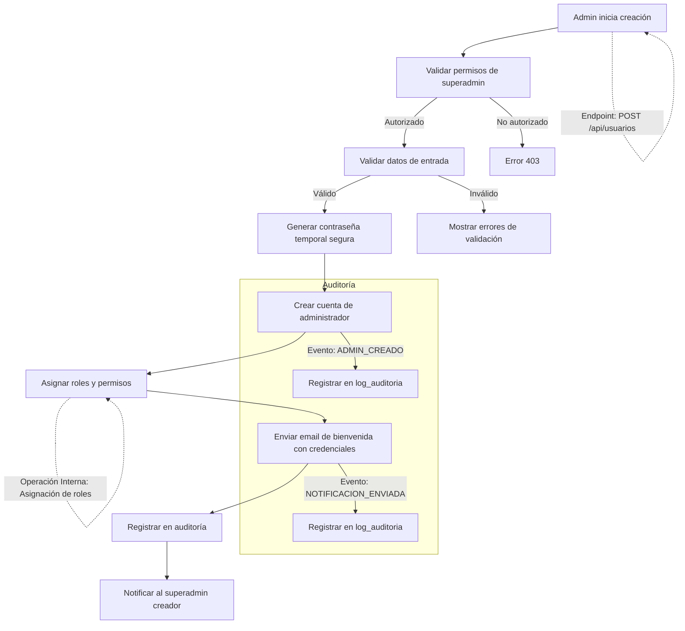

# Flujo de Registro de Administradores

## 1. Creación de Administradores

### 1.1. Diagrama de Flujo



### 1.2. Validaciones para Administradores

#### 1.2.1. Datos Requeridos
- Nombre completo (mínimo 3 caracteres, máximo 100)
- Email corporativo (formato válido, dominio verificado)
- Rol (debe existir en el sistema)
- Sucursal (opcional, dependiendo del rol)

#### 1.2.2. Validaciones de Seguridad
- Verificar que el email no esté en uso
- Validar dominio de email corporativo
- Verificar que el rol asignado no exceda los permisos del creador
- Validar jerarquía de roles

### 1.3. Proceso de Creación

1. **Generación de Credenciales**
   - Crear contraseña temporal segura (16+ caracteres)
   - Establecer fecha de expiración (24h)
   - Forzar cambio en primer inicio
   - Registrar hash seguro

2. **Asignación de Permisos**
   - Validar permisos del creador
   - Asignar roles según jerarquía
   - Aplicar políticas de seguridad
   - Registrar asignación

3. **Notificación**
   - Enviar credenciales por canal seguro
   - Incluir instrucciones de primer acceso
   - Especificar políticas de seguridad
   - Proporcionar contacto de soporte

## 2. Aprobación de Solicitudes de Acceso

### 2.1. Diagrama de Flujo

```mermaid
flowchart TD
    A[Solicitud de acceso] --> B[Validar datos básicos]
    B -->|Válido| C[Crear registro pendiente]
    B -->|Inválido| D[Rechazar con mensaje]
    C --> E[Notificar a superadmin]
    E --> F[Revisar solicitud]
    F -->|Aprobar| G[Crear cuenta de administrador]
    F -->|Rechazar| H[Notificar rechazo]
    G --> I[Asignar roles iniciales]
    I --> J[Enviar credenciales seguras]
    J --> K[Registrar en auditoría]
    
    %% Referencias a endpoints
    A -.->|Endpoint: POST /api/solicitudes-acceso| A
    F -.->|Endpoint: PUT /api/solicitudes-acceso/{id}/aprobacion| F
    G -.->|Operación Interna: Creación de usuario| G
    
    %% Flujo de auditoría
    subgraph Auditoría
    C -->|Evento: SOLICITUD_ACCESO_CREADA| CA[Registrar en log_auditoria]
    G -->|Evento: ADMIN_APROBADO| GA[Registrar en log_auditoria]
    H -->|Evento: SOLICITUD_RECHAZADA| HA[Registrar en log_auditoria]
    end
```

### 2.2. Consideraciones de Seguridad

- **Proceso de Aprobación**:
  - Requiere aprobación de al menos un superadmin
  - Validación de documentos de identidad
  - Verificación de empleo/contrato
  - Entrevista de seguridad inicial

- **Acceso Inicial**:
  - Credenciales temporales con expiración (24h)
  - Autenticación de dos factores obligatoria
  - Sesión restringida hasta cambio de contraseña
  - Acceso limitado a recursos críticos inicialmente

## 3. Integración con Directorio Corporativo

### 3.1. Fuentes de Datos
- Active Directory/LDAP corporativo
- Sistema de Recursos Humanos
- Base de datos de empleados
- Proveedores de identidad empresarial

### 3.2. Proceso de Sincronización

1. Autenticación segura con el directorio
2. Sincronización programada de usuarios
3. Mapeo de grupos a roles
4. Actualización de estado (bajas/cambios)
5. Notificación de cambios
6. Registro de auditoría detallado

### 3.3. Endpoints de Sincronización
- `POST /api/sincronizacion/ejecutar` - Iniciar sincronización manual
- `GET /api/sincronizacion/estado` - Ver estado de la última sincronización
- `GET /api/sincronizacion/errores` - Consultar errores de sincronización

## 4. Notificaciones para Administradores

### 4.1. Notificación de Nueva Cuenta
**Asunto**: [ADMIN] Credenciales de Acceso al Sistema

```
Estimado/a [Nombre],

Se ha creado una cuenta de administrador a tu nombre en [Nombre del Sistema].

Tus credenciales temporales son:
- Usuario: [Email Corporativo]
- Contraseña temporal: [Contraseña Temporal]
- Enlace de acceso: [URL del Sistema]

**Importante**:
1. Debes cambiar tu contraseña en el primer inicio de sesión
2. La contraseña temporal expira en 24 horas
3. Se requiere autenticación de dos factores

Para mayor seguridad, nunca compartas tus credenciales.

Atentamente,
Equipo de Seguridad de [Nombre de la Compañía]
```

### 4.2. Notificación de Aprobación
**Asunto**: [ADMIN] Tu solicitud de acceso ha sido aprobada

```
Estimado/a [Nombre],

Nos complace informarte que tu solicitud de acceso como [Rol] ha sido aprobada.

Detalles de acceso:
- Fecha de aprobación: [Fecha]
- Rol asignado: [Rol]
- Nivel de acceso: [Nivel]
- Restricciones aplicables: [Detalles]

Recuerda que:
- Tu actividad será monitoreada por razones de seguridad
- Debes seguir las políticas de seguridad de la compañía
- Cualquier uso inadecuado será investigado

Para comenzar, inicia sesión en: [URL del Sistema]

Atentamente,
Equipo de Administración
```

## 5. Auditoría y Cumplimiento

### 5.1. Eventos de Auditoría
- `SOLICITUD_ACCESO_CREADA`: Nueva solicitud de acceso
- `ADMIN_APROBADO`: Cuenta de administrador aprobada
- `ADMIN_RECHAZADO`: Solicitud de acceso rechazada
- `CREDENCIALES_ENVIADAS`: Envío de credenciales
- `INTENTO_ACCESO_NO_AUTORIZADO`: Intento de acceso no autorizado
- `CAMBIO_ESTADO_CUENTA`: Cambios en el estado de la cuenta

### 5.2. Controles de Seguridad
- Autenticación de dos factores obligatoria
- Registro detallado de todas las acciones
- Revisión periódica de accesos
- Alertas para actividades sospechosas
- Cumplimiento de normativas (ISO 27001, GDPR, etc.)

### 5.3. Métricas Clave
- Tiempo promedio de aprobación
- Tasa de aprobación/rechazo
- Actividad de cuentas recién creadas
- Intentos fallidos de autenticación
- Uso de privilegios administrativos

## 6. Gestión del Ciclo de Vida

### 6.1. Alta de Administradores
- Proceso de verificación de identidad
- Asignación inicial de permisos
- Capacitación en seguridad
- Período de prueba supervisado

### 6.2. Mantenimiento de Cuentas
- Revisiones periódicas de acceso
- Actualización de permisos según necesidades
- Renovación de credenciales
- Auditorías de seguridad regulares

### 6.3. Baja de Administradores
- Proceso de desvinculación seguro
- Revocación inmediata de accesos
- Transferencia de responsabilidades
- Retención de registros según política

## 7. Recuperación de Acceso

### 7.1. Proceso de Recuperación
1. Verificación de identidad en múltiples pasos
2. Aprobación de otro administrador
3. Generación de credenciales temporales
4. Forzar cambio de contraseña
5. Notificación al equipo de seguridad

### 7.2. Seguridad Adicional
- Registro detallado de recuperaciones
- Límite de intentos
- Período de enfriamiento entre solicitudes
- Verificación adicional para operaciones sensibles

## 8. Integración con Sistemas Externos

### 8.1. Directorio Activo/LDAP
- Sincronización bidireccional segura
- Mapeo de grupos a roles
- Políticas de contraseñas unificadas

### 8.2. Herramientas de Monitoreo
- Integración con SIEM
- Alertas en tiempo real
- Reportes de cumplimiento
- Análisis de comportamiento

### 8.3. Automatización
- APIs para gestión programática
- Webhooks para eventos críticos
- Scripts de mantenimiento
- Herramientas de línea de comandos
