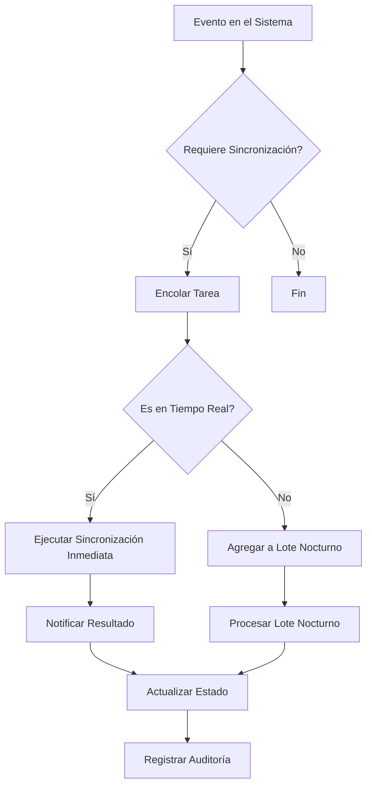

# Integración con Sistema ERP

## 1. Visión General

Este documento describe la integración del módulo de usuarios con el sistema ERP corporativo para sincronización de datos maestros de clientes, empleados y proveedores.

## 2. Objetivos de la Integración

- Mantener sincronizados los datos de usuarios entre sistemas
- Evitar duplicación de información
- Automatizar procesos de aprovisionamiento de usuarios
- Garantizar la consistencia de datos críticos

## 3. Modelo de Sincronización

### 3.1. Flujo de Sincronización



### 3.2. Tipos de Sincronización

1. **Sincronización en Tiempo Real**
   - Creación de usuarios críticos
   - Actualizaciones de estado (activo/inactivo)
   - Cambios en roles y permisos
   - Actualizaciones de información de contacto

2. **Sincronización Diferida**
   - Actualizaciones masivas
   - Datos históricos
   - Información no crítica

## 4. Mapeo de Datos

### 4.1. Campos Principales

| Campo Local | Campo ERP | Tipo | Requerido | Notas |
|------------|----------|------|-----------|-------|
| id | CODIGO | String | Sí | ID único del usuario |
| email | EMAIL | String | Sí | Debe ser único |
| dni | NUMERO_DOC | String | Sí | Validar formato |
| firstName | NOMBRE | String | Sí | |
| lastName | APELLIDO | String | Sí | |
| phone | TELEFONO | String | No | |
| address | DIRECCION | String | No | |
| role | PERFIL | Enum | Sí | Mapeo a roles del sistema |
| status | ESTADO | String | Sí | A=Activo, I=Inactivo |
| createdAt | FECHA_ALTA | DateTime | Sí | |
| updatedAt | FECHA_MODIF | DateTime | No | |

### 4.2. Mapeo de Roles

| Rol Local | Código ERP | Descripción |
|-----------|------------|-------------|
| admin | ADM | Administrador del Sistema |
| vendor | VEN | Vendedor |
| optometrist | OPO | Optómetra |
| client | CLI | Cliente |
| supplier | PRO | Proveedor |

## 5. API de Integración

### 5.1. Endpoints del ERP

#### Obtener Usuario
```
GET /api/usuarios/{id}
```

#### Buscar Usuarios
```
GET /api/usuarios?q={query}&page={page}&limit={limit}
```

#### Crear Usuario
```
POST /api/usuarios
```

#### Actualizar Usuario
```
PUT /api/usuarios/{id}
```

#### Desactivar Usuario
```
DELETE /api/usuarios/{id}
```

### 5.2. Autenticación

- **Método**: OAuth 2.0 Client Credentials
- **Token Endpoint**: `/oauth/token`
- **Scopes**: `users.read users.write`
- **Tiempo de vida del token**: 1 hora

### 5.3. Ejemplo de Solicitud

```http
POST /api/usuarios HTTP/1.1
Content-Type: application/json
Authorization: Bearer {access_token}

{
  "CODIGO": "USR12345",
  "NOMBRE": "Juan",
  "APELLIDO": "Pérez",
  "EMAIL": "juan.perez@ejemplo.com",
  "NUMERO_DOC": "12345678",
  "TELEFONO": "+5491155555555",
  "DIRECCION": "Av. Siempreviva 123",
  "PERFIL": "CLI",
  "ESTADO": "A"
}
```

## 6. Manejo de Errores

### 6.1. Códigos de Error

| Código | Descripción | Acción Recomendada |
|--------|-------------|-------------------|
| 400 | Solicitud incorrecta | Validar formato de los datos |
| 401 | No autorizado | Verificar token de acceso |
| 403 | Prohibido | Verificar permisos |
| 404 | No encontrado | Verificar ID del usuario |
| 409 | Conflicto | Usuario ya existe |
| 429 | Demasiadas solicitudes | Reducir frecuencia de llamadas |
| 500 | Error del servidor | Reintentar más tarde |

### 6.2. Reintentos

- **Máximo de reintentos**: 3
- **Backoff exponencial**: 1s, 2s, 4s
- **Timeout por solicitud**: 10 segundos

## 7. Seguridad

### 7.1. Consideraciones

- Todos los datos en tránsito deben estar cifrados (HTTPS)
- No almacenar credenciales en texto plano
- Implementar rotación de credenciales
- Registrar todas las operaciones de sincronización
- Validar y sanitizar todas las entradas

### 7.2. Auditoría

- Registrar todas las operaciones de sincronización
- Incluir marca de tiempo, usuario y resultado
- Mantener registros por 2 años
- Alertar sobre fallos recurrentes

## 8. Monitoreo y Métricas

### 8.1. Métricas Clave

- Tiempo de respuesta promedio
- Tasa de éxito/error
- Volumen de datos sincronizados
- Tiempo de procesamiento por lote

### 8.2. Alertas

- Errores de autenticación
- Tiempos de respuesta elevados
- Tasa de error > 1%
- Intentos fallidos consecutivos

## 9. Mantenimiento

### 9.1. Actualizaciones

- Planificar ventanas de mantenimiento
- Notificar con anticipación cambios en la API
- Mantener documentación actualizada
- Probar en ambiente de pruebas antes de producción

### 9.2. Backup y Recuperación

- Realizar backup de datos antes de actualizaciones
- Tener plan de rollback
- Documentar procedimientos de recuperación

## 10. Consideraciones Adicionales

### 10.1. Migración Inicial

- Planificar migración fuera de horario pico
- Validar integridad de datos
- Realizar pruebas de carga
- Tener plan de contingencia

### 10.2. Rendimiento

- Implementar caché para consultas frecuentes
- Paginar resultados de búsqueda
- Optimizar consultas a la base de datos
- Monitorear uso de recursos
