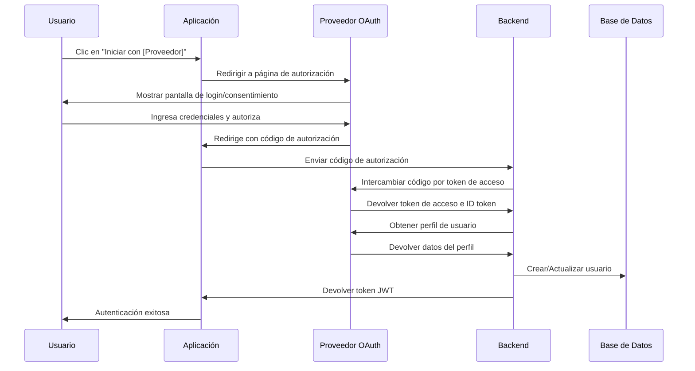

# Integración con OAuth

## 1. Visión General

Este documento describe la implementación de autenticación mediante proveedores externos (Google, Facebook, etc.) utilizando el protocolo OAuth 2.0.

## 2. Proveedores Soportados

| Proveedor | Estado  | ID Cliente Requerido | Scopes por Defecto |
|-----------|---------|----------------------|-------------------|
| Google    | Activo  | Sí                   | email profile     |
| Facebook  | Activo  | Sí                   | email public_profile |
| Microsoft | Pendiente | No implementado     | -                |
| Apple     | Planeado | No implementado      | -                |

## 3. Flujo de Autenticación

### 3.1. Diagrama de Secuencia



### 3.2. Pasos Detallados

1. **Inicio del Flujo OAuth**
   - El usuario selecciona un proveedor OAuth
   - La aplicación redirige al endpoint de autorización del proveedor con:
     - `client_id`: ID de la aplicación registrada con el proveedor
     - `redirect_uri`: URL de redirección tras la autenticación
     - `response_type`: code (para flujo de código de autorización)
     - `scope`: permisos solicitados (email, perfil)
     - `state`: token CSRF para prevenir ataques

2. **Procesamiento de la Respuesta**
   - El proveedor redirige de vuelta a la aplicación con un código de autorización
   - El backend valida el estado (CSRF protection)
   - Se intercambia el código por un token de acceso

3. **Obtención del Perfil**
   - Se utiliza el token de acceso para obtener los datos del perfil
   - Se normalizan los datos del proveedor a nuestro formato interno

4. **Gestión del Usuario**
   - Búsqueda de usuario existente por email o ID del proveedor
   - Si no existe, se crea un nuevo usuario
   - Si existe, se actualizan los datos del perfil si es necesario
   - Se vincula la cuenta OAuth al usuario

## 4. Modelo de Datos

### 4.1. Esquema de Usuario OAuth

```prisma
model OAuthAccount {
  id            String   @id @default(cuid())
  provider      String   // google, facebook, etc.
  providerId    String   // ID único del usuario en el proveedor
  userId        String
  user          User     @relation(fields: [userId], references: [id])
  accessToken   String   @db.Text
  refreshToken  String?  @db.Text
  expiresAt     DateTime?
  tokenType     String?
  scope         String?
  idToken      String?  @db.Text
  createdAt     DateTime @default(now())
  updatedAt     DateTime @updatedAt

  @@unique([provider, providerId])
  @@index([userId])
}
```

### 4.2. Mapeo de Campos

| Proveedor | Campo Local | Campo Remoto | Notas |
|-----------|-------------|--------------|-------|
| Google | email | email | |
| | firstName | given_name | |
| | lastName | family_name | |
| | avatar | picture | |
| Facebook | email | email | |
| | firstName | first_name | |
| | lastName | last_name | |
| | avatar | picture.data.url | Requiere campo picture |

## 5. Seguridad

### 5.1. Consideraciones de Seguridad

- **PKCE (Proof Key for Code Exchange)**: Implementado para clientes públicos
- **State Parameter**: Para prevenir ataques CSRF
- **Validación de Tokens**: Verificación de firma y expiración
- **Almacenamiento Seguro**: Los tokens se almacenan cifrados
- **Scopes Mínimos**: Solo se solicitan los permisos necesarios

### 5.2. Manejo de Errores

| Código de Error | Descripción | Acción Recomendada |
|-----------------|-------------|-------------------|
| invalid_request | Falta parámetro requerido | Verificar parámetros de solicitud |
| unauthorized_client | Cliente no autorizado | Verificar configuración del cliente OAuth |
| access_denied | Usuario denegó el consentimiento | Informar al usuario |
| unsupported_response_type | Tipo de respuesta no soportado | Actualizar implementación |
| invalid_scope | Scope inválido o desconocido | Verificar scopes solicitados |
| server_error | Error del servidor OAuth | Reintentar más tarde |
| temporarily_unavailable | Servicio temporalmente no disponible | Reintentar más tarde |

## 6. Implementación Técnica

### 6.1. Endpoints

#### Iniciar Autenticación
```
GET /api/auth/oauth/:provider
```

#### Callback de Autenticación
```
GET /api/auth/oauth/:provider/callback
```

#### Desvincular Cuenta OAuth
```
DELETE /api/auth/oauth/:provider
```

### 6.2. Configuración

```typescript
// config/oauth.ts
interface OAuthConfig {
  clientID: string;
  clientSecret: string;
  callbackURL: string;
  scope: string[];
  userProfileURL?: string;
  authorizationURL?: string;
  tokenURL?: string;
  userInfoURL?: string;
  // Mapeo de campos personalizado
  profileMapper?: (profile: any) => UserProfile;
}

const oauthConfig: Record<string, OAuthConfig> = {
  google: {
    clientID: process.env.GOOGLE_CLIENT_ID!,
    clientSecret: process.env.GOOGLE_CLIENT_SECRET!,
    callbackURL: `${process.env.APP_URL}/api/auth/oauth/google/callback`,
    scope: ['email', 'profile'],
    // ...otras configuraciones específicas de Google
  },
  // ...otros proveedores
};
```

## 7. Pruebas

### 7.1. Pruebas Unitarias

- Flujo de autenticación exitoso
- Manejo de errores del proveedor
- Validación de tokens
- Mapeo de perfiles

### 7.2. Pruebas de Integración

- Flujo completo de registro
- Vinculación de cuentas existentes
- Manejo de errores de red
- Pruebas de rendimiento

## 8. Monitoreo y Métricas

### 8.1. Métricas Clave

- Tasa de éxito de autenticación
- Tiempo promedio de autenticación
- Tasa de error por proveedor
- Uso por dispositivo/ubicación

### 8.2. Alertas

- Errores de autenticación
- Tiempos de respuesta elevados
- Intentos sospechosos
- Cambios en patrones de uso

## 9. Mantenimiento

### 9.1. Actualizaciones de API

- Monitorear cambios en las APIs de los proveedores
- Planificar actualizaciones con anticipación
- Mantener compatibilidad con versiones anteriores

### 9.2. Documentación

- Mantener actualizada la documentación de integración
- Documentar cambios en los endpoints
- Proporcionar ejemplos de implementación
