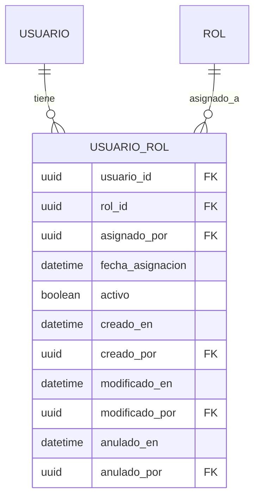

# Modelo UsuarioRol

## Visión General

El modelo `usuario_rol` es una tabla de unión que establece una relación muchos a muchos entre los modelos `Usuario` y `Rol`. Este modelo es fundamental para el sistema de autorización, permitiendo que los usuarios tengan múltiples roles con diferentes niveles de acceso.



## Documentación Técnica

- [Reglas de Negocio](./reglas_negocio.md)
- [Seguridad y Control de Acceso](./seguridad.md)
- [Estructura de la Base de Datos](#estructura-de-la-base-de-datos)
- [API de Integración](#api-de-integración)
- [Ejemplos de Uso](#ejemplos-de-uso)

## Estructura de la Base de Datos

### Tabla: usuario_rol

| Columna | Tipo | Requerido | Valor por Defecto | Descripción |
|---------|------|-----------|-------------------|-------------|
| usuario_id | UUID | Sí | - | Clave foránea a la tabla usuarios |
| rol_id | UUID | Sí | - | Clave foránea a la tabla roles |
| asignado_por | UUID | Sí | - | Usuario que realizó la asignación |
| fecha_asignacion | TIMESTAMP | No | CURRENT_TIMESTAMP | Fecha de asignación |
| activo | BOOLEAN | No | true | Estado de la asignación |
| creado_en | TIMESTAMP | No | CURRENT_TIMESTAMP | Fecha de creación |
| creado_por | UUID | No | - | Usuario que creó el registro |
| modificado_en | TIMESTAMP | No | CURRENT_TIMESTAMP | Última modificación |
| modificado_por | UUID | No | - | Último usuario que modificó |
| anulado_en | TIMESTAMP | Sí | NULL | Fecha de anulación (soft delete) |
| anulado_por | UUID | Sí | NULL | Usuario que anuló el registro |

### Índices

- **PRIMARY KEY** (`usuario_id`, `rol_id`)
- **INDEX** `idx_usuario_rol_activo` (`activo`)
- **FOREIGN KEY** `fk_usuario_rol_usuario` (`usuario_id`) REFERENCES `usuarios`(`id`)
- **FOREIGN KEY** `fk_usuario_rol_rol` (`rol_id`) REFERENCES `roles`(`id`)
- **FOREIGN KEY** `fk_usuario_rol_asignador` (`asignado_por`) REFERENCES `usuarios`(`id`)

## API de Integración

### Endpoints Principales

#### Asignar Roles a Usuario

```http
POST /api/usuarios/{id}/roles
Content-Type: application/json
Authorization: Bearer {token}

{
  "roles": ["vendedor", "cajero"]
}
```

#### Eliminar Asignación de Roles

```http
DELETE /api/usuarios/{usuarioId}/roles
Content-Type: application/json
Authorization: Bearer {token}

{
  "roles": ["cajero"]
}
```

#### Obtener Roles de Usuario

```http
GET /api/usuarios/{id}/roles
Authorization: Bearer {token}
```

### Códigos de Respuesta

| Código | Descripción |
|--------|-------------|
| 200 | Operación exitosa |
| 400 | Datos de entrada inválidos |
| 401 | No autenticado |
| 403 | No autorizado |
| 404 | Recurso no encontrado |
| 409 | Conflicto (ej: rol ya asignado) |
| 500 | Error interno del servidor |

## Ejemplos de Uso

### 1. Asignación de Roles

```javascript
// Ejemplo de asignación de roles
async function asignarRoles(usuarioId, roles) {
  try {
    const response = await fetch(`/api/usuarios/${usuarioId}/roles`, {
      method: 'POST',
      headers: {
        'Content-Type': 'application/json',
        'Authorization': `Bearer ${token}`
      },
      body: JSON.stringify({ roles })
    });
    
    if (!response.ok) {
      throw new Error('Error al asignar roles');
    }
    
    return await response.json();
  } catch (error) {
    console.error('Error:', error);
    throw error;
  }
}
```

### 2. Validación de Permisos

```typescript
// Verificar si un usuario tiene un rol específico
function tieneRol(usuario: Usuario, rolBuscado: string): boolean {
  return usuario.roles.some(rol => rol.nombre === rolBuscado);
}

// Uso
if (tieneRol(usuarioActual, 'administrador')) {
  // Realizar acción restringida
}
```

## Consideraciones de Implementación

### 1. Rendimiento

- **Caché**: Implementar caché de roles de usuario para reducir consultas a la base de datos
- **Paginación**: Usar paginación en consultas que puedan devolver muchos registros
- **Índices**: Mantener índices optimizados para consultas frecuentes

### 2. Seguridad

- **Validación de Entrada**: Sanitizar y validar todos los parámetros de entrada
- **Control de Acceso**: Implementar verificación de permisos en cada operación
- **Registro de Auditoría**: Registrar todas las operaciones críticas

### 3. Mantenimiento

- **Migraciones**: Usar migraciones para cambios en el esquema
- **Backups**: Realizar copias de seguridad periódicas
- **Monitoreo**: Monitorear el rendimiento y uso de la tabla

## Documentación Relacionada

- [Documentación de la API de Usuarios](../usuario/endpoints/gestion.md)
- [Documentación del Modelo de Roles](../rol/README.md)
- [Reglas de Negocio Detalladas](./reglas_negocio.md)
- [Seguridad y Control de Acceso](./seguridad.md)

## Historial de Cambios

| Fecha | Versión | Cambio | Autor |
|-------|---------|--------|-------|
| 2025-06-07 | 1.0.0 | Documentación inicial | Equipo de Desarrollo |
