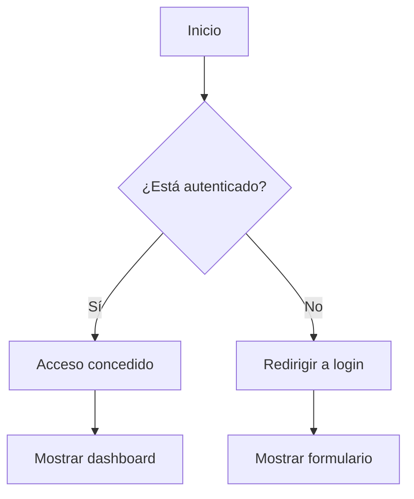
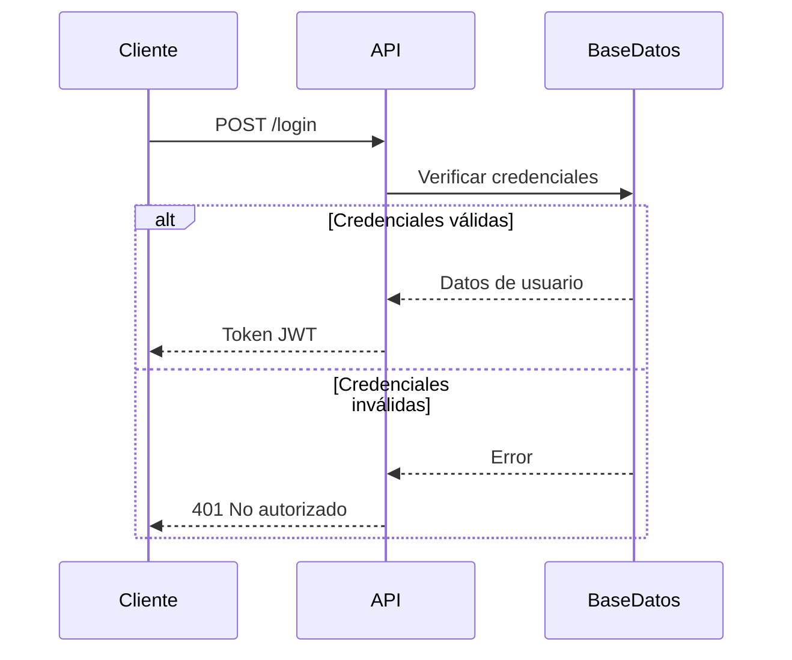
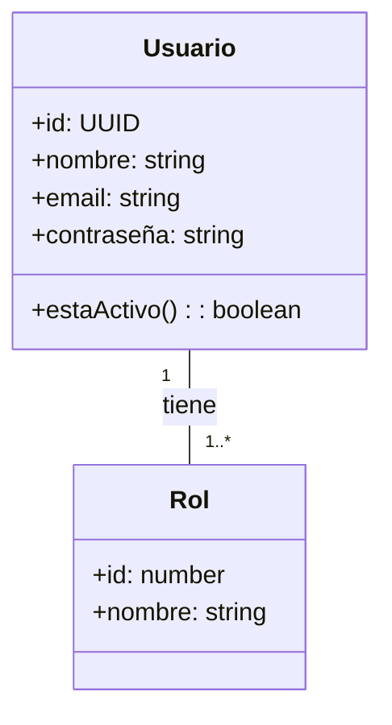
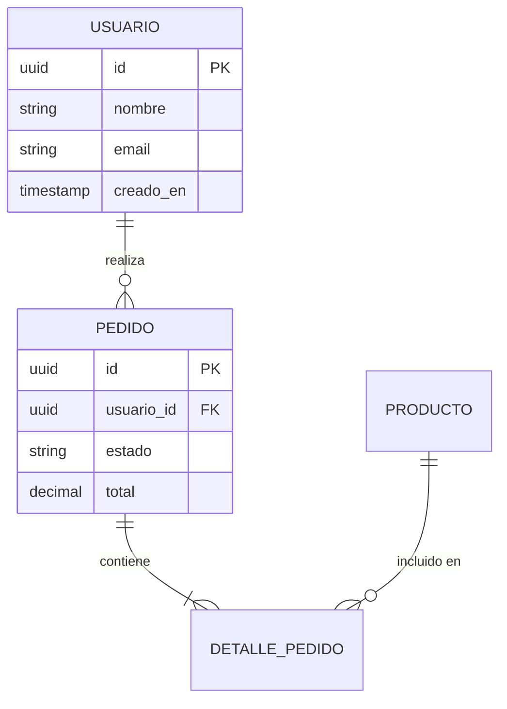
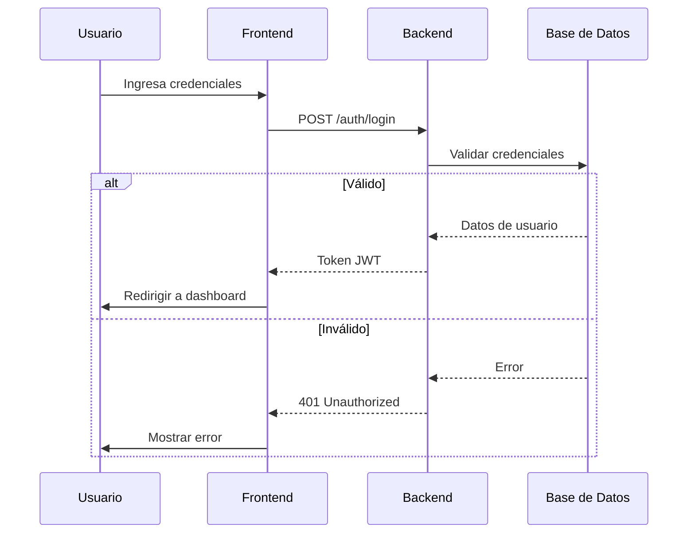
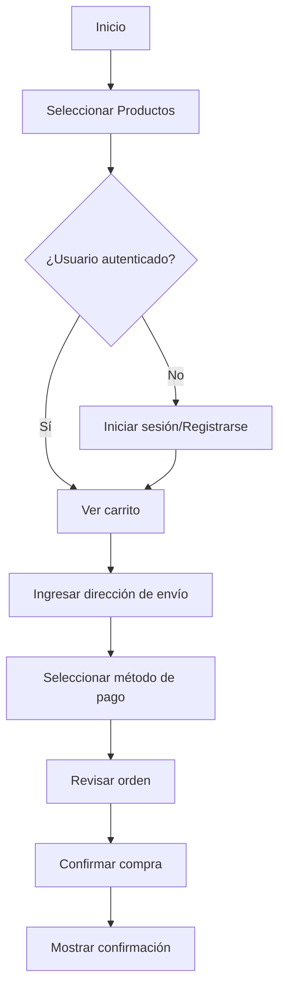

# Guía de Estilo para Diagramas con Mermaid.js

## 1. Tipos de Diagramas

### 1.1 Diagramas de Flujo (Flowcharts)

**Uso:** Para representar procesos, flujos de trabajo o algoritmos.

**Ejemplo:**
````markdown

````
**Resultado:**


**Convenciones:**
- Usar forma rectangular `[]` para procesos
- Usar rombo `{}` para decisiones
- Usar flechas `-->` para el flujo
- Mantener la dirección de izquierda a derecha o de arriba a abajo

### 1.2 Diagramas de Secuencia

**Uso:** Para mostrar interacciones entre componentes en el tiempo.

**Ejemplo:**
````markdown

````

**Convenciones:**
- Usar `->>` para mensajes síncronos
- Usar `-->>` para respuestas
- Usar `alt/else` para condiciones
- Agrupar con `loop`, `opt`, `par` cuando sea necesario

### 1.3 Diagramas de Clases

**Uso:** Para mostrar la estructura de clases y sus relaciones.

**Ejemplo:**
````markdown

````

**Convenciones:**
- Usar `+` para públicos, `-` para privados, `#` para protegidos
- Especificar tipos de datos
- Documentar relaciones con multiplicidad

## 2. Estilo y Formato

### 2.1 Temas

Usar el tema definido en la configuración global:

````markdown
```mermaid
theme neutral

classDiagram
    class Ejemplo
```
````

### 2.2 Colores

Usar colores consistentes para tipos similares de elementos:

- **Verde**: Procesos exitosos, confirmaciones
- **Rojo**: Errores, advertencias
- **Azul**: Acciones del usuario
- **Gris**: Procesos del sistema

### 2.3 Tamaño y Alineación

- Limitar el ancho a 800px máximo
- Usar subgráficos para diagramas complejos
- Alinear elementos cuando sea posible

## 3. Directrices para Modelos de Datos

### 3.1 Diagramas ER

**Ejemplo:**
````markdown

````

**Convenciones:**
- Usar mayúsculas para nombres de tablas
- Especificar PK/FK claramente
- Usar `||` para cardinalidad uno y `}|` o `|o` para muchos

## 4. Plantillas Comunes

### 4.1 Autenticación

````markdown

````

### 4.2 Flujo de Compra

````markdown

````

## 5. Herramientas y Recursos

### 5.1 Editores Online
- [Mermaid Live Editor](https://mermaid.live/)
- [Mermaid Chart](https://www.mermaidchart.com/)

### 5.2 Extensiones de VS Code
- Mermaid Preview (vstirbu.vscode-mermaid-preview)
- Mermaid Markdown Syntax Highlighting (bpruitt-goddard.mermaid-markdown-syntax-highlighting)

### 5.3 Documentación Oficial
- [Mermaid.js Documentation](https://mermaid.js.org/)
- [Mermaid Cheat Sheet](https://github.com/mermaid-js/mermaid-cheat-sheet)

## 6. Mejores Prácticas

1. **Mantener la simplicidad**: No sobrecargar los diagramas con demasiados detalles.
2. **Consistencia**: Usar la misma convención de nombres y estilos en todos los diagramas.
3. **Comentarios**: Agregar notas explicativas cuando sea necesario.
4. **Validación**: Verificar que los diagramas sean legibles en todos los formatos de salida.
5. **Versionado**: Incluir los archivos .mmd en el control de versiones.

## 7. Plantilla para Nuevos Diagramas

````markdown
## [Nombre del Diagrama]

**Propósito**: [Breve descripción del propósito]

**Alcance**: [Qué cubre este diagrama]

```mermaid
[Diagrama aquí]
```

**Leyenda**:
- [Explicación de elementos especiales]
- [Símbolos usados]

**Notas**:
- [Cualquier información adicional relevante]
- [Supuestos realizados]
````
