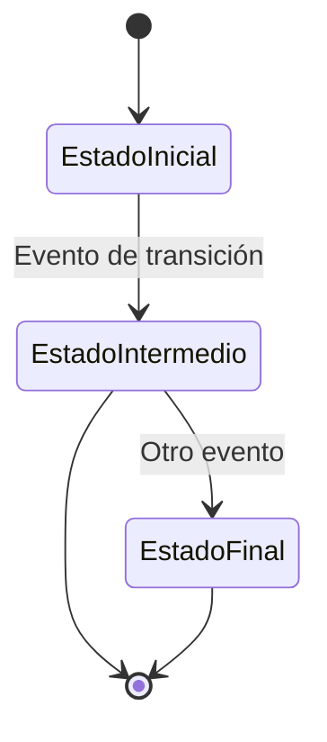

# [Nombre del Modelo] (`nombre_modelo`)

## Descripción
Breve descripción del propósito y responsabilidad del modelo en el sistema.

## Estructura

### Campos

| Nombre | Tipo | Requerido | Valor por Defecto | Validaciones | Descripción |
|--------|------|-----------|-------------------|--------------|-------------|
| `id` | `UUID` | Sí | `uuid_generate_v4()` | Único | Identificador único del registro |
| `campo_ejemplo` | `Tipo` | Sí/No | - | - | Descripción del campo |
| `creado_en` | `timestamp` | Sí | `now()` | - | Fecha de creación |
| `actualizado_en` | `timestamp` | Sí | `now()` | - | Última actualización |

### Relaciones

- **Relación 1**: Tipo de relación con [OtroModelo](#) - Descripción de la relación
- **Relación 2**: Tipo de relación con [OtroModelo2](#) - Descripción de la relación

## Reglas de Negocio

1. **Regla 1**: Descripción detallada de la regla de negocio
   - Ejemplo de aplicación
   - Posibles excepciones

2. **Regla 2**: Otra regla importante

## Validaciones

- **Validación 1**: Descripción de la validación
- **Validación 2**: Otra validación importante

## Estados (si aplica)



## Ejemplos

### Creación

```typescript
const ejemplo = await prisma.nombreModelo.create({
  data: {
    campo1: 'valor1',
    campo2: 'valor2',
    // ...
  },
});
```

### Consulta Básica

```typescript
const registros = await prisma.nombreModelo.findMany({
  where: {
    campo: 'valor',
  },
  include: {
    relacion: true,
  },
});
```

### Actualización

```typescript
const actualizado = await prisma.nombreModelo.update({
  where: { id },
  data: {
    campo: 'nuevo_valor',
  },
});
```

## Consideraciones de Rendimiento

- Índices existentes: `[campo1, campo2]`
- Consultas pesadas comunes y recomendaciones
- Estrategias de caché aplicables

## Seguridad

- Niveles de acceso requeridos
- Consideraciones de privacidad
- Datos sensibles manejados

## Auditoría

- Eventos auditados: Creación, Actualización, Eliminación
- Campos auditados: `[campo1, campo2]`
- Ubicación de logs: `/ruta/a/logs`

## Migraciones

### Creación Inicial
```sql
CREATE TABLE nombre_modelo (
  id UUID PRIMARY KEY DEFAULT uuid_generate_v4(),
  -- otros campos
);
```

### Migración de Ejemplo
```sql
-- Ejemplo de migración para agregar un nuevo campo
ALTER TABLE nombre_modelo
ADD COLUMN nuevo_campo VARCHAR(255);
```

## Referencias

- [Documentación relacionada](#)
- [Estándares aplicados](#)
