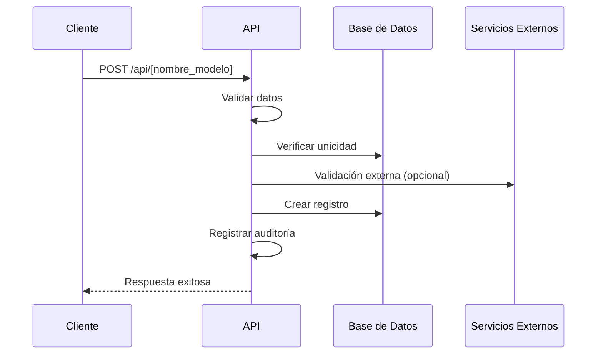

# Flujos de Gestión - [NOMBRE_DEL_MODELO]

## Creación de Registro

### Descripción
Flujo para la creación de un nuevo registro en el sistema.

### Diagrama de Secuencia



### Validaciones

1. **Datos de Entrada**
   - Validar campos requeridos
   - Validar formatos (email, teléfono, etc.)
   - Validar longitud de campos

2. **Reglas de Negocio**
   - Verificar unicidad
   - Validar relaciones existentes
   - Aplicar reglas específicas del dominio

### Código de Ejemplo

```typescript
async function crearRegistro(req, res) {
  try {
    const datos = req.body;
    const usuarioId = req.user.id;
    
    // Validaciones
    const errores = validarDatos(datos);
    if (errores.length > 0) {
      return res.status(400).json({ errores });
    }
    
    // Verificar unicidad
    const existe = await prisma.[nombreModelo].findFirst({
      where: { campoUnico: datos.campoUnico }
    });
    
    if (existe) {
      return res.status(409).json({ 
        error: 'Ya existe un registro con estos datos' 
      });
    }
    
    // Crear registro
    const nuevoRegistro = await prisma.[nombreModelo].create({
      data: {
        ...datos,
        creadoPor: usuarioId,
        actualizadoPor: usuarioId
      }
    });
    
    // Registrar auditoría
    await registrarAuditoria({
      accion: 'CREAR',
      entidad: '[NOMBRE_ENTIDAD]',
      entidadId: nuevoRegistro.id,
      usuarioId,
      ip: req.ip,
      datosAnteriores: {},
      datosNuevos: nuevoRegistro
    });
    
    // Respuesta exitosa
    res.status(201).json({
      mensaje: 'Registro creado exitosamente',
      id: nuevoRegistro.id
    });
    
  } catch (error) {
    console.error('Error al crear registro:', error);
    res.status(500).json({ error: 'Error interno del servidor' });
  }
}
```

## Actualización de Registro

### Descripción
Flujo para actualizar un registro existente.

### Validaciones

1. **Existencia**
   - Verificar que el registro existe
   - Verificar que no esté eliminado (soft delete)

2. **Autorización**
   - Verificar permisos del usuario
   - Validar reglas de negocio para actualización

3. **Concurrencia**
   - Manejo de versionado optimista
   - Bloqueo pesimista si es necesario

### Código de Ejemplo

```typescript
async function actualizarRegistro(req, res) {
  try {
    const { id } = req.params;
    const datos = req.body;
    const usuarioId = req.user.id;
    
    // Obtener registro actual
    const registroActual = await prisma.[nombreModelo].findUnique({
      where: { id }
    });
    
    if (!registroActual) {
      return res.status(404).json({ error: 'Registro no encontrado' });
    }
    
    // Validar estado
    if (registroActual.estado === 'ELIMINADO') {
      return res.status(410).json({ error: 'El registro ha sido eliminado' });
    }
    
    // Aplicar actualización
    const registroActualizado = await prisma.[nombreModelo].update({
      where: { id },
      data: {
        ...datos,
        actualizadoPor: usuarioId,
        version: { increment: 1 }
      }
    });
    
    // Registrar auditoría
    await registrarAuditoria({
      accion: 'ACTUALIZAR',
      entidad: '[NOMBRE_ENTIDAD]',
      entidadId: id,
      usuarioId,
      ip: req.ip,
      datosAnteriores: registroActual,
      datosNuevos: registroActualizado
    });
    
    res.json({
      mensaje: 'Registro actualizado exitosamente',
      datos: omitirCamposSensibles(registroActualizado)
    });
    
  } catch (error) {
    if (error.code === 'P2025') {
      return res.status(404).json({ error: 'Registro no encontrado' });
    }
    console.error('Error al actualizar registro:', error);
    res.status(500).json({ error: 'Error interno del servidor' });
  }
}
```

## Eliminación de Registro

### Descripción
Flujo para eliminar (soft delete) un registro.

### Consideraciones

1. **Verificaciones Previas**
   - Validar que no tenga relaciones activas
   - Verificar permisos de eliminación

2. **Estrategia**
   - Soft delete por defecto
   - Eliminación física bajo condiciones específicas

### Código de Ejemplo

```typescript
async function eliminarRegistro(req, res) {
  try {
    const { id } = req.params;
    const usuarioId = req.user.id;
    
    // Verificar existencia
    const registro = await prisma.[nombreModelo].findUnique({
      where: { id },
      include: { _count: true }
    });
    
    if (!registro) {
      return res.status(404).json({ error: 'Registro no encontrado' });
    }
    
    // Validar relaciones
    if (registro._count.relaciones > 0) {
      return res.status(400).json({
        error: 'No se puede eliminar el registro porque tiene relaciones activas'
      });
    }
    
    // Soft delete
    await prisma.[nombreModelo].update({
      where: { id },
      data: {
        eliminado: true,
        eliminadoPor: usuarioId,
        eliminadoEn: new Date()
      }
    });
    
    // Registrar auditoría
    await registrarAuditoria({
      accion: 'ELIMINAR',
      entidad: '[NOMBRE_ENTIDAD]',
      entidadId: id,
      usuarioId,
      ip: req.ip,
      datosAnteriores: registro,
      datosNuevos: null
    });
    
    res.json({ mensaje: 'Registro eliminado exitosamente' });
    
  } catch (error) {
    console.error('Error al eliminar registro:', error);
    res.status(500).json({ error: 'Error interno del servidor' });
  }
}
```

## Consulta de Registros

### Tipos de Consulta

1. **Búsqueda Paginada**
   - Filtros avanzados
   - Ordenamiento personalizado
   - Inclusión de relaciones

2. **Búsqueda por ID**
   - Datos completos
   - Relaciones anidadas
   - Historial de cambios

### Código de Ejemplo

```typescript
async function buscarRegistros(req, res) {
  try {
    const { 
      pagina = 1, 
      porPagina = 10, 
      ordenarPor = 'creadoEn',
      orden = 'desc',
      buscar,
      ...filtros
    } = req.query;
    
    // Construir where
    const where = { ...filtros };
    
    if (buscar) {
      where.OR = [
        { nombre: { contains: buscar, mode: 'insensitive' } },
        { descripcion: { contains: buscar, mode: 'insensitive' } },
        // otros campos de búsqueda
      ];
    }
    
    // Contar total
    const total = await prisma.[nombreModelo].count({ where });
    
    // Obtener registros
    const registros = await prisma.[nombreModelo].findMany({
      where,
      skip: (pagina - 1) * porPagina,
      take: parseInt(porPagina),
      orderBy: { [ordenarPor]: orden },
      include: {
        // relaciones necesarias
      }
    });
    
    res.json({
      datos: registros.map(omitirCamposSensibles),
      paginacion: {
        pagina: parseInt(pagina),
        porPagina: parseInt(porPagina),
        total,
        totalPaginas: Math.ceil(total / porPagina)
      }
    });
    
  } catch (error) {
    console.error('Error al buscar registros:', error);
    res.status(500).json({ error: 'Error interno del servidor' });
  }
}
```

## Procesos por Lotes

### Descripción
Operaciones que afectan a múltiples registros.

### Casos de Uso

1. **Importación Masiva**
   - Carga desde archivo
   - Validación por lotes
   - Procesamiento asíncrono

2. **Actualización Masiva**
   - Aplicar cambios a múltiples registros
   - Transacciones atómicas
   - Rollback en caso de error

### Código de Ejemplo

```typescript
async function importarRegistros(archivo, usuarioId) {
  const registros = await parsearArchivo(archivo);
  const resultados = {
    total: registros.length,
    exitosos: 0,
    fallidos: 0,
    errores: []
  };
  
  // Procesar en lotes
  for (let i = 0; i < registros.length; i += 100) {
    const lote = registros.slice(i, i + 100);
    
    await prisma.$transaction(async (tx) => {
      for (const registro of lote) {
        try {
          // Validar registro
          const errores = validarRegistro(registro);
          if (errores.length > 0) {
            throw new Error(errores.join(', '));
          }
          
          // Guardar
          await tx.[nombreModelo].create({
            data: {
              ...registro,
              creadoPor: usuarioId,
              actualizadoPor: usuarioId
            }
          });
          
          resultados.exitosos++;
          
        } catch (error) {
          resultados.fallidos++;
          resultados.errores.push({
            linea: i + 1,
            error: error.message
          });
        }
      }
    });
  }
  
  return resultados;
}
```

## Manejo de Errores

### Tipos de Errores

| Código | Tipo | Descripción |
|--------|------|-------------|
| 400 | Bad Request | Datos de entrada inválidos |
| 401 | Unauthorized | No autenticado |
| 403 | Forbidden | Sin permisos |
| 404 | Not Found | Recurso no encontrado |
| 409 | Conflict | Conflicto con el estado actual |
| 422 | Unprocessable Entity | Error de validación |
| 500 | Internal Server Error | Error del servidor |

### Estructura de Error

```json
{
  "error": "Descripción del error",
  "codigo": "CODIGO_ERROR",
  "detalles": {
    "campo1": "Error específico del campo 1",
    "campo2": "Error específico del campo 2"
  },
  "timestamp": "2025-06-07T16:30:00.000Z"
}
```

## Mejoras de Rendimiento

### Estrategias de Caché

1. **Nivel de Aplicación**
   - Cachear consultas frecuentes
   - Invalidación por eventos

2. **Nivel de Base de Datos**
   - Índices optimizados
   - Particionamiento de tablas

### Consultas Eficientes

- Usar `select` para traer solo campos necesarios
- Aprovechar relaciones de Prisma
- Evitar N+1 queries

### Paginación

- Implementar cursor-based pagination para grandes conjuntos de datos
- Límites razonables de tamaño de página
- Metadatos de paginación en respuestas

## Documentación de la API

### Esquema OpenAPI

```yaml
openapi: 3.0.0
info:
  title: API de [NOMBRE_DEL_MODELO]
  version: 1.0.0
  description: Endpoints para la gestión de [NOMBRE_DEL_MODELO]

paths:
  /api/[nombre_modelo]:
    get:
      summary: Listar registros
      parameters:
        - $ref: '#/components/parameters/pagina'
        - $ref: '#/components/parameters/porPagina'
      responses:
        '200':
          description: Lista de registros
          content:
            application/json:
              schema:
                $ref: '#/components/schemas/RespuestaPaginada'
    
    post:
      summary: Crear registro
      requestBody:
        required: true
        content:
          application/json:
            schema:
              $ref: '#/components/schemas/[NombreModelo]Input'
      responses:
        '201':
          description: Registro creado
          
  /api/[nombre_modelo]/{id}:
    get:
      summary: Obtener registro por ID
      parameters:
        - $ref: '#/components/parameters/id'
      responses:
        '200':
          description: Detalles del registro
          content:
            application/json:
              schema:
                $ref: '#/components/schemas/[NombreModelo]'
    
    put:
      summary: Actualizar registro
      parameters:
        - $ref: '#/components/parameters/id'
      requestBody:
        required: true
        content:
          application/json:
            schema:
              $ref: '#/components/schemas/[NombreModelo]Input'
      responses:
        '200':
          description: Registro actualizado
    
    delete:
      summary: Eliminar registro
      parameters:
        - $ref: '#/components/parameters/id'
      responses:
        '200':
          description: Registro eliminado
```

## Pruebas

### Estrategia de Pruebas

1. **Unitarias**
   - Validaciones
   - Lógica de negocio
   - Funciones auxiliares

2. **Integración**
   - Endpoints
   - Base de datos
   - Servicios externos

3. **Rendimiento**
   - Carga
   - Estrés
   - Escalabilidad

### Ejemplo con Jest

```javascript
describe('Gestión de [NOMBRE_DEL_MODELO]', () => {
  let token;
  let idRegistro;
  
  beforeAll(async () => {
    // Configuración inicial
    await prisma.$connect();
    await limpiarBaseDeDatos();
    
    // Autenticación
    const res = await request(app)
      .post('/api/auth/login')
      .send({ usuario: 'admin', password: 'admin123' });
      
    token = res.body.token;
  });
  
  afterAll(async () => {
    await prisma.$disconnect();
  });
  
  test('Crear registro exitoso', async () => {
    const res = await request(app)
      .post('/api/[nombre_modelo]')
      .set('Authorization', `Bearer ${token}`)
      .send({
        campo1: 'valor1',
        campo2: 'valor2'
      });
      
    expect(res.statusCode).toBe(201);
    expect(res.body).toHaveProperty('id');
    
    idRegistro = res.body.id;
  });
  
  test('Obtener registro por ID', async () => {
    const res = await request(app)
      .get(`/api/[nombre_modelo]/${idRegistro}`)
      .set('Authorization', `Bearer ${token}`);
      
    expect(res.statusCode).toBe(200);
    expect(res.body).toHaveProperty('id', idRegistro);
  });
  
  // Más pruebas...
});
```

## Consideraciones de Seguridad

### Protección de Datos

1. **Encriptación**
   - Datos sensibles en reposo
   - Comunicaciones seguras (TLS)

2. **Control de Acceso**
   - Mínimos privilegios
   - Validación de roles
   - Registro de accesos

### Prevención de Ataques

- Inyección SQL
- XSS (Cross-Site Scripting)
- CSRF (Cross-Site Request Forgery)
- Dos/DDos

### Monitoreo

- Alertas de seguridad
- Análisis de logs
- Auditorías periódicas

## Mantenimiento

### Versionado

- Semántico (MAYOR.MENOR.PARCHE)
- Documentación por versión
- Compatibilidad hacia atrás

### Actualizaciones

- Plan de migración
- Copias de seguridad
- Ventanas de mantenimiento

### Depuración

- Logs detallados
- Modo desarrollo
- Herramientas de diagnóstico
