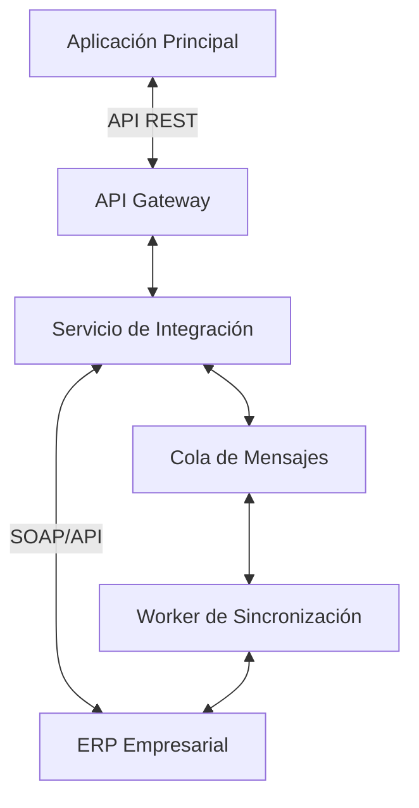

# Integración con ERP - [NOMBRE_DEL_MODELO]

## Visión General

Este documento describe la integración del modelo [NOMBRE_DEL_MODELO] con el sistema de planificación de recursos empresariales (ERP) de la empresa. La integración permite la sincronización bidireccional de datos entre los sistemas.

## Diagrama de Arquitectura



## Flujos de Sincronización

### Sincronización en Tiempo Real (Eventos)

1. **Creación/Actualización**
   - La aplicación principal publica un evento
   - El servicio de integración procesa el evento
   - Se envía al ERP mediante API
   - Se confirma la recepción

2. **Eliminación**
   - Se marca como eliminado en la aplicación
   - Se envía evento de desactivación al ERP
   - Se sincroniza el estado

### Sincronización Programada (Lotes)

1. **Exportación Nocturna**
   - Se ejecuta diariamente a las 2:00 AM
   - Procesa todos los cambios pendientes
   - Genera archivos de lote para el ERP
   - Confirma la recepción

2. **Importación de Referencias**
   - Descarga catálogos maestros
   - Actualiza referencias internas
   - Aplica reglas de mapeo

## Mapeo de Datos

### Campos del Modelo a ERP

| Campo Local | Campo ERP | Tipo | Requerido | Transformación |
|------------|----------|------|-----------|----------------|
| id | ID | string | Sí | - |
| codigo | CODE | string | No | Formato: PREFIJO-{id} |
| nombre | NAME | string | Sí | Mayúsculas |
| estado | STATUS | string | No | Mapear a: ACTIVO/INACTIVO |
| fechaCreacion | CREATE_DATE | datetime | No | Formato: YYYYMMDDHHmmss |

### Valores por Defecto

```javascript
const valoresPorDefecto = {
  TIPO_REGISTRO: 'NORMAL',
  ORIGEN: 'PORTAL',
  EMPRESA: '001',
  MONEDA: 'USD',
  ESTADO: 'A'
};
```

## API de Integración

### Endpoints

#### `POST /api/integracion/erp/sincronizar`

Sincroniza un registro individual con el ERP.

**Body:**
```json
{
  "id": "uuid-del-registro",
  "accion": "CREAR|ACTUALIZAR|ELIMINAR",
  "intentos": 0,
  "prioridad": "ALTA|MEDIA|BAJA"
}
```

#### `GET /api/integracion/erp/estado/:id`

Obtiene el estado de sincronización de un registro.

**Response:**
```json
{
  "id": "uuid-del-registro",
  "sincronizado": true,
  "fechaUltimaSincronizacion": "2025-06-07T16:30:00.000Z",
  "idExterno": "ERP12345",
  "errores": []
}
```

## Manejo de Errores

### Reintentos Automáticos

| Intento | Tiempo de Espera |
|---------|-------------------|
| 1 | 1 minuto |
| 2 | 5 minutos |
| 3 | 15 minutos |
| 4 | 1 hora |
| 5+ | 4 horas |

### Códigos de Error

| Código | Descripción | Acción Recomendada |
|--------|-------------|-------------------|
| ERP001 | Tiempo de espera agotado | Reintentar |
| ERP002 | Formato inválido | Corregir datos y reintentar |
| ERP003 | No autorizado | Verificar credenciales |
| ERP404 | Recurso no encontrado | Verificar referencia |
| ERP500 | Error del servidor ERP | Notificar al equipo de soporte |

## Configuración

### Variables de Entorno

```env
# Configuración de Conexión
ERP_API_URL=https://erp.empresa.com/api
ERP_API_KEY=tu-api-key
ERP_API_TIMEOUT=30000

# Configuración de Reintentos
ERP_MAX_RETRIES=5
ERP_RETRY_DELAY=60000

# Configuración de Cola
QUEUE_NAME=erp-sync
CONCURRENCY=5
```

### Parámetros de Sincronización

```javascript
const configSincronizacion = {
  // Tamaño de lote para sincronizaciones masivas
  batchSize: 100,
  
  // Campos a ignorar en la sincronización
  camposIgnorados: ['creadoPor', 'actualizadoPor', 'eliminado'],
  
  // Reglas de transformación personalizadas
  transformaciones: {
    fecha: (valor) => moment(valor).format('YYYYMMDD'),
    estado: (valor) => valor ? 'A' : 'I'
  },
  
  // Configuración de reintentos
  reintentos: {
    max: 3,
    delay: 5000,
    factor: 2
  }
};
```

## Implementación Técnica

### Estructura del Proyecto

```
integracion-erp/
├── src/
│   ├── services/
│   │   ├── erp.service.js       # Cliente del ERP
│   │   └── sync.service.js      # Lógica de sincronización
│   ├── jobs/
│   │   ├── sync.job.js         # Tareas programadas
│   │   └── retry.job.js         # Reintentos fallidos
│   ├── models/
│   │   └── sync-status.model.js # Estado de sincronización
│   └── routes/
│       └── erp.routes.js      # Endpoints de la API
├── scripts/
│   ├── initial-sync.js      # Sincronización inicial
│   └── fix-errors.js         # Herramienta de corrección
└── test/
    ├── unit/
    └── integration/
```

### Dependencias Clave

```json
{
  "dependencies": {
    "axios": "^0.27.2",
    "bull": "^4.10.0",
    "winston": "^3.8.1",
    "joi": "^17.6.0",
    "moment": "^2.29.4",
    "uuid": "^9.0.0"
  },
  "devDependencies": {
    "jest": "^28.1.3",
    "nock": "^13.2.9",
    "supertest": "^6.2.4"
  }
}
```

## Pruebas

### Pruebas Unitarias

```javascript
describe('Servicio de Integración ERP', () => {
  let servicioErp;
  
  beforeEach(() => {
    // Configuración inicial
    servicioErp = new ErpService();
    
    // Mock de la API del ERP
    nock('https://erp.empresa.com')
      .post('/api/articulos')
      .reply(201, { id: 'ERP123', status: 'success' });
  });
  
  test('debe sincronizar un artículo correctamente', async () => {
    const articulo = {
      id: '123e4567-e89b-12d3-a456-426614174000',
      codigo: 'ART-001',
      nombre: 'Artículo de prueba',
      precio: 99.99
    };
    
    const resultado = await servicioErp.sincronizarArticulo(articulo);
    
    expect(resultado).toHaveProperty('id');
    expect(resultado.id).toBe('ERP123');
    expect(resultado.status).toBe('success');
  });
});
```

### Pruebas de Integración

```javascript
describe('API de Integración', () => {
  let app;
  
  beforeAll(async () => {
    app = require('../../app');
    await app.connect();
  });
  
  afterAll(async () => {
    await app.disconnect();
  });
  
  test('debe sincronizar un artículo mediante la API', async () => {
    const respuesta = await request(app)
      .post('/api/integracion/erp/sincronizar')
      .send({
        id: '123e4567-e89b-12d3-a456-426614174000',
        accion: 'CREAR',
        prioridad: 'ALTA'
      });
      
    expect(respuesta.status).toBe(202);
    expect(respuesta.body).toHaveProperty('id');
    expect(respuesta.body).toHaveProperty('estado', 'PENDIENTE');
  });
});
```

## Monitoreo y Mantenimiento

### Métricas Clave (KPIs)

1. **Tiempo de Sincronización**
   - Promedio: < 1s por registro
   - P95: < 5s
   - P99: < 10s

2. **Tasa de Éxito**
   - Sincronizaciones exitosas: > 99.9%
   - Reintentos: < 1%
   - Errores: < 0.1%

3. **Rendimiento**
   - Registros procesados por minuto
   - Uso de recursos (CPU, memoria)
   - Tiempo de respuesta del ERP

### Alertas Configuradas

1. **Críticas (Página)**
   - Error en la conexión con el ERP > 5 minutos
   - Tasa de error > 5% en los últimos 15 minutos
   - Cola de sincronización > 10,000 registros

2. **Advertencias (Correo)**
   - Tiempo de sincronización > 30s
   - Reintentos > 3 para el mismo registro
   - Espacio en disco < 20%

### Mantenimiento Programado

| Tarea | Frecuencia | Ventana | Responsable |
|-------|------------|---------|-------------|
| Limpieza de logs | Diario | 1:00 AM | Sistema |
| Backup de datos | Semanal | Dom 2:00 AM | Sistema |
| Actualización de API | Mensual | 1er domingo 4:00 AM | DevOps |
| Revisión de rendimiento | Trimestral | - | Equipo de Desarrollo |

## Plan de Contingencia

### Escenario 1: Caída del ERP

1. **Detección**
   - Monitoreo activo de la conexión
   - Alertas automáticas

2. **Mitigación**
   - Modo offline con cola local
   - Reintentos automáticos
   - Notificación al equipo de soporte

3. **Recuperación**
   - Sincronización incremental al restaurarse
   - Verificación de integridad
   - Reporte de incidencias

### Escenario 2: Pérdida de Datos

1. **Prevención**
   - Backups incrementales cada hora
   - Retención de 7 días
   - Pruebas de recuperación mensuales

2. **Recuperación**
   - Restauración desde backup
   - Sincronización diferencial
   - Validación de consistencia

## Documentación Adicional

### Referencias Técnicas

- [Documentación API ERP](https://erp.empresa.com/api-docs)
- [Guía de Implementación](https://confluence.empresa.com/display/IT/ERP+Integration+Guide)
- [Estándares de Seguridad](https://confluence.empresa.com/display/SEC/ERP+Security+Standards)

### Contactos de Soporte

| Rol | Nombre | Correo | Teléfono |
|-----|--------|--------|----------|
| Soporte N1 | Equipo de Soporte | soporte@empresa.com | +123456789 |
 | Soporte N2 | Administradores ERP | erp-admin@empresa.com | +123456788 |
 | Gerencia TI | Director de TI | cto@empresa.com | +123456787 |

### Historial de Cambios

| Fecha | Versión | Cambio | Autor |
|-------|---------|--------|-------|
| 2025-06-07 | 1.0.0 | Versión inicial | Equipo de Integración |
| 2025-06-08 | 1.1.0 | Agregado manejo de reintentos | Ana López |
| 2025-06-09 | 1.2.0 | Implementado modo offline | Carlos Ruiz |
